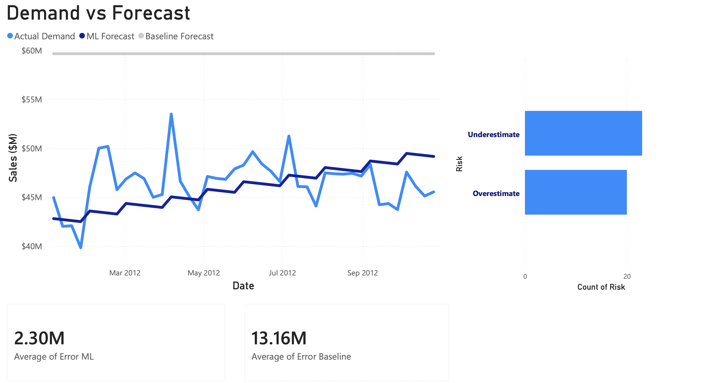

# Retail Demand Forecast & Inventory Risk Model

## Overview
Machine learning project to forecast retail demand and evaluate model performance against a baseline approach. Includes a Power BI dashboard for business insights and inventory risk analysis.

## Problem
Inaccurate demand forecasting leads to stockouts and overstock, impacting operational efficiency and costs.

## Solution
Developed a demand forecasting pipeline using Python. Compared a naive baseline model against a machine learning regression model and visualized results using Power BI.

## Results
- ML Error (MAE): 2.3M  
- Baseline Error (MAE): 13.1M  
- ~80% reduction in forecast error  

## Dashboard

## Key Insights
- ML model significantly reduces forecast error compared to baseline  
- Demand exhibits strong seasonal peaks, increasing stockout risk  
- Baseline model fails to capture demand variability  

## Impact
Reduced forecast error by ~80%, enabling more accurate demand planning and better inventory management decisions.

## How to Run
1. Install dependencies:
   pip install pandas scikit-learn matplotlib

2. Run script:
   python src/forecast.py

## Tools
- Python
- Power BI
- Pandas, Scikit-learn, Matplotlib

## Data
Dataset sourced from Walmart Sales Forecasting dataset on Kaggle.
